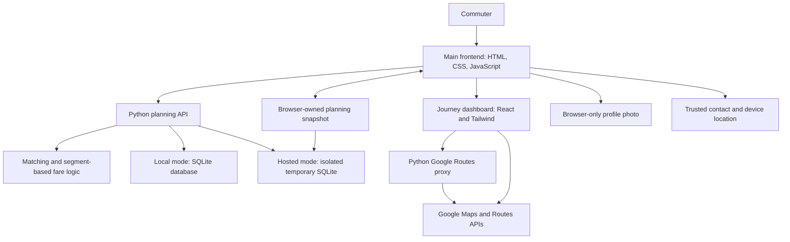
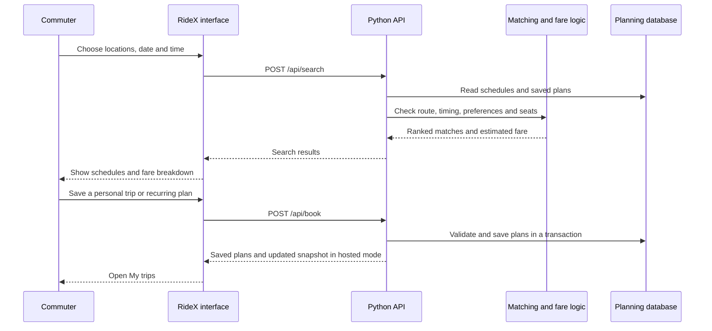
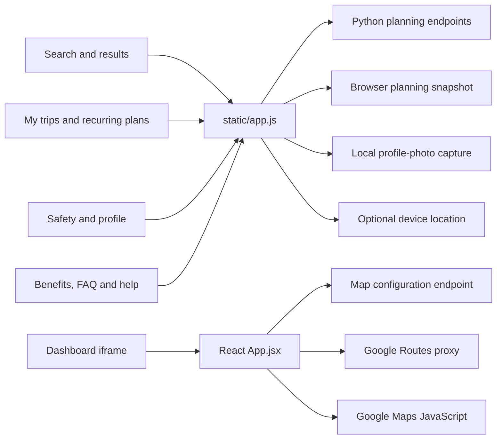
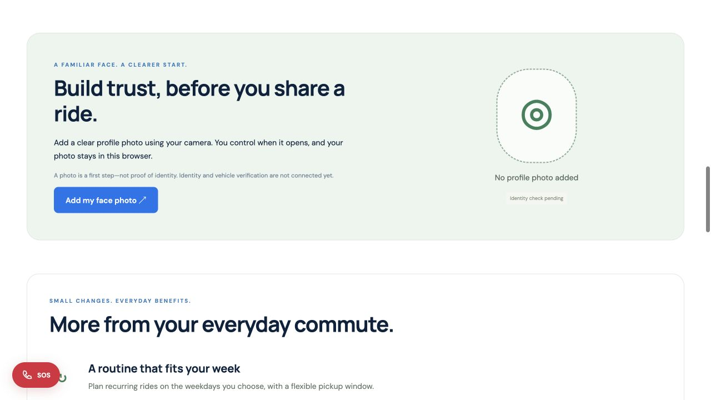

# RideX — Carpooling that fits your everyday commute

RideX is a Bengaluru carpooling hackathon project that explores a practical problem: commuters often travel in the same direction but struggle to coordinate routes, timing, costs and trust. It combines route-overlap matching, recurring commute plans, segment-based cost sharing and consent-based safety tools in a responsive web interface.

The backend uses Python and SQLite. The main frontend uses HTML, CSS and JavaScript; the journey dashboard uses React and Tailwind CSS. Google Maps and Google Routes integration is implemented and awaits API-key configuration.

| Submission | Link |
|---|---|
| Public source code | [GitHub repository](https://github.com/aaravchoudhary018/FireTech-) |
| Live application | [RideX on Vercel](https://firetech-murex.vercel.app/) |
| Journey dashboard | [Open journey map](https://firetech-murex.vercel.app/dashboard/) |
| Presentation | [Download ideathon PPTX](docs/presentation/RideX-Ideathon-Presentation.pptx) |
| Team size | 6 members |
| Current scope | Interactive personal commute planner with example schedules |

## Full App Flow In Short

A commuter chooses pickup, destination, departure date and time. The browser sends these preferences to the Python API, which checks route order, weekday, time overlap and seat availability. Matching schedules are ranked, and each shared road segment is split between the driver and passengers onboard. The commuter can inspect an estimate, save one trip or a recurring plan, update personal trip progress and leave a rating. The dedicated map page retrieves Google road routes and traffic when configured. Profile-photo capture and SOS location sharing require explicit user action.

**Saved plans do not contact a driver or reserve a real seat.** Existing schedules are examples, and hosted planning data belongs to the visitor's browser. This scope is distinguished from a shared, authenticated carpool service throughout the interface.

## Evaluation Access

- Open the [live application](https://firetech-murex.vercel.app/); no account, password or login is required.
- For an example weekday journey, choose **Indiranagar Metro Station → Whitefield (Kadugodi) Metro Station**, a weekday within 90 days, and a departure around **08:30**.
- Leave **Verified drivers only** unchecked: no independent identity-verification service is connected, so no driver is presented as verified.
- Click **Find my ride**, inspect a matching example schedule and its fare breakdown, then save it to **My trips** if desired.
- Use **Add my face photo** to explore the camera dialog. A captured image remains in the browser and does not verify identity.
- Open **SOS** to save a trusted contact, use phone links or request your own device location. No automatic alert is dispatched.
- Until Google API keys are configured, **Live map** provides a configuration explanation and an external Google Maps directions link.

## Features Implemented

| Feature | Implementation and status |
|---|---|
| Bengaluru location catalog | 10 real stations, landmarks and commute areas |
| Route and time matching | Ordered route overlap, operating weekday and flexible pickup window |
| Search feedback | Loading animation, ranked results, empty states and retry handling |
| Distance-based cost sharing | Each planning segment split by onboard occupancy, using integer paise |
| Recurring commute plans | Availability checks and atomic saving over a 14-day window |
| Trip management | Upcoming-plan cancellation, series cancellation, manual progress and ratings |
| Offer a recurring route | Personal offers with weekdays, seats, vehicle cost and women-only preference |
| Safety preferences | Self-reported women-only eligibility and explicit verification status |
| Profile photo | Permission-based camera capture, local save/delete, camera stopped on close |
| Emergency contact | Browser-saved contact, telephone links, optional location capture and copying |
| Google journey dashboard | Dark map, traffic layer, traffic-colored route and provider distance/ETA; API keys pending |
| Content and navigation | Carpool benefits, FAQ accordions, help dialogs and functional footer navigation |
| Regression checks | 17 Python tests covering matching, planning state, fares, migration and map response parsing |

## How We Approached the Problem

We separated matching and fare logic from HTTP handling. `core.py` contains the location catalog, estimated route graph, direction checks, time calculations and segment-level cost sharing. `app.py` provides local APIs and SQLite-backed planning actions. This keeps the business rules independently testable.

The main interface focuses on the commuter's actual decisions: route, time flexibility, recurring weekdays and cost estimate. Search makes progress and results visible. Safety tools request camera or location access only when the user chooses them.

For hosting, `api/index.py` adapts planning actions to Vercel's Python functions. Each request uses an isolated temporary database and a browser-owned snapshot. The map proxy is separate: `api/map.py` calls Google Routes with a server-only key and accepts only locations in the catalog.

We kept profile photos separate from verification. A captured photo is not proof of identity or liveness. Likewise, personal trip progress is not described as driver GPS tracking, and missing map credentials do not produce fabricated traffic data.

## Trade-offs We Made

- **Python standard library:** no Python package installation is needed, which simplifies evaluation. A larger service would benefit from a production framework and operational infrastructure.
- **Estimated route graph:** matching and fares are easy to inspect and test. Google road distance/ETA is displayed separately; it does not yet recalculate fare segments or matching overlap.
- **Browser-owned hosted state:** the planner works without a hosted database account. It cannot provide authoritative shared bookings, user accounts or cross-device synchronization.
- **Prebuilt React dashboard:** Vercel serves committed assets; evaluators can run Python without a frontend build. Dashboard-source changes require rebuilding those assets.
- **Privacy-conscious safety scope:** photos and location are permission-based. Independent identity/vehicle verification, driver tracking and emergency dispatch remain outside the implemented scope.

## App Architecture



## Flow Summary

| Step | Application flow |
|---|---|
| 01 — Entry point | `app.py` initializes local SQLite and serves the interface; Vercel uses `api/index.py` and static assets. |
| 02 — Initial state | `/api/state` supplies locations, profile preferences, offers and saved plans. |
| 03 — Search | `/api/search` validates inputs and calls `core.match()` to rank eligible schedules. |
| 04 — Cost estimate | `core.fare()` splits each shared graph segment among the driver and riders onboard. |
| 05 — Save plan | `/api/book` checks availability and duplicate dates; recurring plans are saved atomically. |
| 06 — Manage trip | `/api/booking` handles start, manual progress, cancellation and completed-trip ratings. |
| 07 — Safety tools | Browser camera capture stays local; SOS offers user-triggered calls and optional location copying. |
| 08 — Map view | `/api/map-config` supplies the restricted browser key; `/api/route` retrieves Google route geometry and traffic. |
| 09 — Persistence | Local mode uses on-disk SQLite; hosted mode restores and returns a browser-owned snapshot per request. |

## Tech Stack

| Layer | Technologies |
|---|---|
| Main frontend | HTML5, CSS, JavaScript, native dialogs and FAQ controls |
| Journey dashboard | React 19, Tailwind CSS 4, Vite 7 |
| Backend | Python 3.9+ standard library; HTTP server, SQLite, JSON and urllib |
| Planning storage | SQLite locally; browser snapshot and temporary SQLite on Vercel |
| Maps integration | Google Maps JavaScript API, TrafficLayer and Google Routes API |
| Device capabilities | MediaDevices camera API, Geolocation API and Clipboard API |
| Testing | Python `unittest` |
| Deployment | GitHub and Vercel Python functions/static hosting |

## Component Interaction Flow



## Frontend Architecture Flow



## Backend Components

| File or function | Responsibility |
|---|---|
| `app.py` | Local HTTP server, request validation, planning actions and SQLite transactions |
| `core.py` | Catalog, shortest-path planning, route ordering, pickup-time estimates, matching and fare splitting |
| `api/index.py` | Vercel handler; action allowlist, browser-snapshot validation, request isolation and response persistence |
| `api/map.py` | Restricted Google Routes requests, traffic response normalization and 120-second per-process cache |
| `app.init_db()` | Initialize tables and example schedules |
| `app.migrate_locations()` | Upgrade legacy location IDs and remove unsupported verification status |
| `app.dispatch()` | Search, plan saving, trip management, profile updates and personal offers |
| `core.fare()` | Occupancy-aware cost splitting using integer paise |
| `core.next_dates()` | Generate eligible dates within the recurring window |
| `vercel.json` | Connect public paths to static assets and Python handlers |

## Project Structure

```text
FireTech-/
├── README.md
├── app.py
├── core.py
├── vercel.json
├── .gitignore
├── .vercelignore
├── dashboard-source.zip
├── api/
│   ├── index.py
│   └── map.py
├── static/
│   ├── index.html
│   ├── app.js
│   ├── style.css
│   ├── hero.png
│   ├── rx-logo.png
│   └── dashboard/
│       ├── index.html
│       └── assets/
├── docs/
│   └── images/
│       └── ridex-trust-benefits.png
└── tests/
    ├── test_app.py
    ├── test_hosted.py
    └── test_maps.py
```

The React source is supplied in `dashboard-source.zip`. Extracting it provides `src/App.jsx`, `src/Icon.jsx`, `src/style.css`, `src/main.jsx`, `package.json` and the Vite configuration. Earlier unused map-simulation modules remain in the archive; they are not imported by the current application.

## Quick Start

### Prerequisites

- Python 3.9 or newer.
- Git, or download and extract the repository ZIP.
- A browser; camera/location require a supported secure context such as HTTPS or localhost.
- Node.js 20.19+ or 22.12+ only if rebuilding the Vite 7 dashboard.
- Google Maps credentials only for the embedded live map and traffic.

### 01 — Get the project

```bash
git clone https://github.com/aaravchoudhary018/FireTech-.git
cd FireTech-
```

Alternatively, use **GitHub → Code → Download ZIP**, extract it, and open the extracted project folder.

### 02 — Start the Python app

```bash
python3 app.py --port 8005
```

Open [http://127.0.0.1:8005/](http://127.0.0.1:8005/). No Python dependencies need installation. The local database is created automatically and excluded from Git. Set `ROUTEKIND_DB` to use a different writable database path.

### 03 — Run tests

```bash
python3 -m unittest discover -s tests -v
```

The current suite has **17 tests** covering matching, fare sharing, women-only preferences, capacity, duplicate/recurring plans, cancellation, progress/rating, hosted isolation, location migration, traffic interval parsing, missing keys and refusal of self-verification. Tests use temporary databases. Actual Google provider calls require configured keys and separate integration checks.

### 04 — Rebuild the dashboard, if needed

Extract `dashboard-source.zip` into a separate folder, then run inside that folder:

```bash
npm install
npm run build
```

Copy the contents of its `dist/` folder into this project's `static/dashboard/`. The Vite base is `/dashboard/`. Use the integrated Python app to check the rebuilt frontend together with the API.

## Google Maps setup — keys not provided yet

1. Open [Google Cloud Console](https://console.cloud.google.com/), select/create a project, enable billing, and configure budgets and API quotas.
2. Enable **Maps JavaScript API** and **Routes API**.
3. Create two separate API keys.
4. Restrict the browser key to **Maps JavaScript API** and website referrers such as `https://firetech-murex.vercel.app/*` and `http://127.0.0.1:8005/*`.
5. Restrict the private server key to **Routes API**. Use server IP restrictions when fixed outbound IPs are available; do not apply browser referrer restrictions to this key. A production public proxy needs appropriate quotas and access controls.
6. Add the following variables to **Vercel → Project → Settings → Environment Variables**:

| Variable | Purpose |
|---|---|
| `GOOGLE_MAPS_BROWSER_KEY` | Restricted browser-public key for Maps JavaScript |
| `GOOGLE_ROUTES_API_KEY` | Private server-only key for Google Routes |
| `ROUTEKIND_DB` | Optional local SQLite path; not a durable hosted database solution |

7. Redeploy. Open **Live map**, choose two locations and click **Show route**.
8. Check valid routing, key/billing failures, quota errors and unavailable routes. Without keys, use the external Google Maps directions link.

For local routing, set the Google variables in your terminal environment before starting Python. Never commit their values, paste them into screenshots, or give the private key a `VITE_` prefix.

The server requests `TRAFFIC_AWARE_OPTIMAL`, `TRAFFIC_ON_POLYLINE`, `GEO_JSON_LINESTRING` and an explicit field mask. It caches successful location pairs for 120 seconds per process. Unknown traffic stays grey. Route traffic is fetched on request, not continuously streamed. There is no signal-phase/countdown feed or driver GPS feed.

References: [Google Maps loader](https://developers.google.com/maps/documentation/javascript/load-maps-js-api), [traffic-aware routes](https://developers.google.com/maps/documentation/routes/traffic_on_polylines), [key security](https://developers.google.com/maps/api-security-best-practices).

## API Reference

### GET endpoints

| Endpoint | Description |
|---|---|
| `/api/state` | Catalog, profile, example schedules, personal offers and saved plans |
| `/api/map-config` | Browser-public Google key and whether a server Routes key is configured |
| `/api/route?origin=indiranagar&destination=whitefield` | Google road route and traffic for two allowed catalog locations |

### POST endpoints

| Endpoint | Description |
|---|---|
| `/api/search` | Match route order, weekday, timing, preferences and seats |
| `/api/book` | Save one or recurring personal plans after availability checks |
| `/api/booking` | Start, manually progress, cancel or rate a planned trip |
| `/api/profile` | Save profile preferences and trusted-contact fields |
| `/api/offer` | Save a personal recurring offer |
| `/api/verify` | Explicitly refuses identity verification: no verification provider connected |
| `/api/sos` | Record a local planning event; does not send emergency messages |

Local requests accept JSON action payloads. Hosted POST requests use an envelope containing `payload` and the latest `demo_snapshot`; this internal compatibility field stores editable planning data, not account credentials. Hosted responses return an updated snapshot for the browser to save. The map API is independent of this snapshot.

## Data Model and Persistence

| SQLite table | Contents |
|---|---|
| `rides` | Example schedules and personal offers: path, weekdays, seats, vehicle, cost and preferences |
| `bookings` | Saved plans: date, route, estimate, series, manual progress and rating |
| `settings` | The single user's profile preferences and trusted-contact fields |
| `events` | Personal trip alert logs |

Each table stores an ID and a JSON payload. Local mode uses on-disk SQLite. Hosted mode restores a browser-owned snapshot into a temporary request database and removes the database after the response. Requests use a context-local database reference to keep concurrent visitors isolated. Browser snapshots are editable and are not a security boundary, verified identity or authoritative inventory.

Profile photos and the SOS drawer's contact are browser-local. Planning/profile payloads are sent to the server to process actions. Device coordinates are not uploaded to the planning API; the user can choose to copy a Google Maps location link and share it themselves.

## Bengaluru Locations and Research

Indiranagar Metro Station · Whitefield (Kadugodi) Metro Station · Cubbon Park Metro Station · UB City, Vittal Mallya Road · Pattanagere Metro Station · Nadaprabhu Kempegowda (Majestic) Metro Station · Jayanagar Metro Station · Koramangala, 80 Feet Road · Domlur Bus Stand · MG Road Metro Station.

Sources: [BMRCL official station chart](https://english.bmrc.co.in/pd/RetailKioskRateChart.pdf), [Bengaluru Urban tourism](https://bengaluruurban.nic.in/en/tourism/), [UB City official address](https://ubcitybangalore.in/contact-us/).

These are real Bengaluru commute areas and landmarks, not guaranteed pickup bays. Whitefield and Pattanagere are outside the central core. Confirm the exact safe meeting point; graph distances are planning estimates, not researched navigation distances.

## Screenshots

### Trust tools and carpool benefits



## Deployment

| Component | Platform |
|---|---|
| Source code and collaboration | Public GitHub repository |
| Main web interface and built React assets | Vercel static hosting |
| Planning and route endpoints | Vercel Python functions |
| Hosted planning persistence | Visitor's browser and isolated request snapshots |
| Local persistence | SQLite on disk |
| Navigation and traffic provider | Google Maps Platform; credentials pending |

Import the repository into Vercel with the repository root (`./`) as the root directory. Keep the included `vercel.json`: it routes public paths to static assets and Python handlers. Do not point Vercel at the dashboard-source ZIP or add an unrelated frontend build/output override.

The existing deployment is [firetech-murex.vercel.app](https://firetech-murex.vercel.app/). Git-connected commits to the production branch trigger deployment. Configure Google keys in Vercel, redeploy after environment changes, and check the public link in a logged-out browser before submitting. Keep SQLite files, secrets and private images out of GitHub.

## Project Limitations and Assumptions

- Existing schedules, vehicles and graph travel times are examples. No driver is contacted or accepts a booking.
- Hosted offers/plans are private to a browser, with no account login, shared durable database or cross-device sync.
- Matching uses exact catalog stops and an estimated graph; nearby detours and arbitrary address matching are not implemented.
- Pickup estimates assume a planning speed of 24 km/h. Travel dates are limited to 90 days, and recurring passenger plans cover 14 days.
- Fares are stored estimates; no payments, refunds or final settlement are processed. Google distance does not yet update those fare calculations.
- Profile photos are not identity, document, gender or liveness verification. Profiles remain unverified; women-only eligibility is self-reported.
- Trip progress is entered by the user, not a live driver feed. SOS provides calls/location copying, not automatic notification or emergency dispatch.
- Embedded Google maps and traffic require billing-enabled API keys. Real provider integration has not been tested without those credentials.
- Browser storage may be blocked or cleared. Photos and contact data should only be used on a trusted device.
- A real launch requires authenticated users, server-authoritative shared capacity, driver acceptance, durable storage, identity/vehicle checks, operational support and appropriate API access controls.

## Team and Contributions

Six-member team. Names and usernames are recorded only when supplied; contribution descriptions will be completed by the team.

| Member | Name | GitHub | Contribution |
|---|---|---|---|
| 1 | Tanmay Daga | [tanmay-daga](https://github.com/tanmay-daga) | — |
| 2 | Dibakar Das | [dibakar704](https://github.com/dibakar704) | — |
| 3 | Suryansh Singh | [rsuryansh9026](https://github.com/rsuryansh9026) | — |
| 4 | Aarav Choudhary | [aaravchoudhary018](https://github.com/aaravchoudhary018) | — |
| 5 | Aman Verma | [Aman-verma-crypto](https://github.com/Aman-verma-crypto) | — |
| 6 | — | — | — |

## Submission Checklist

- [x] Public repository with runnable source and README.
- [x] Vercel application link and evaluation instructions.
- [x] Feature status, trade-offs, architecture, APIs and limitations documented.
- [x] Local setup and regression-test instructions.
- [ ] Complete all six member names/usernames and actual contributions.
- [ ] Configure Google Maps keys if an embedded traffic map is required for evaluation.
- [ ] Confirm both submission links open on the judges' devices and meet the event's specific rules.

Built for the RideX carpooling hackathon project.
